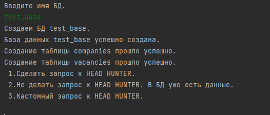
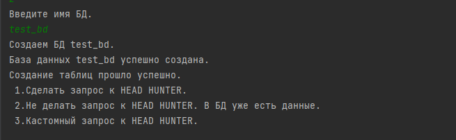
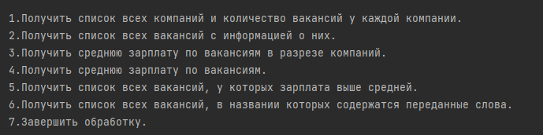
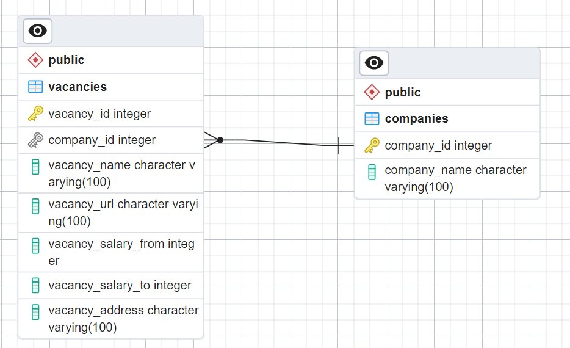

## Работа с базами данных 
### Программа забирает данные о компаниях с HEAD HUNTER и обрабатывает их взаимодействую с БД
## Требования
* Python (latest version)
## Установка
* Загрузить репозиторий
* Установить зависимости (pip install -r requirements.txt)
* Прописать данные для подключения к БД (файл database.ini)
## Как это работает
* Программа выполняет GET запросы к HEAD HUNTER
* По умолчанию, список компаний: ["Газпром", "Yandex", "МТС", "ПИК", "Ланит"]
* Пользователь имеет возможность указать компанию для получения данных
* Найденные данные сохраняются в БД
* Сделано ограничение на поиск компаний: 1 страница / 10 позиций. Возвращать только работодателей у которых есть в данный момент открытые вакансии.
* Сделано ограничение на поиск вакансий: 1 страница / 50 позиций
## Структура БД

## Структура
* src/DBManager.py: описание класса для взаимодействия с БД
* src/RequestManager.py описание класса для взаимодействия с HEAD HUNTER
* src/utils.py: дополнительные функции для обработки и словарь с меню для пользователей
* src/processing.py основной код обработки
* database.ini - файл конфигурации подключения к БД
* main.py
* README.md
* requirements.txt
## Интерфейс программы
* Пользователь выбирает вариант работы с БД

* Пользователь выбирает вариант обработки данных из HEAD HUNTER
*
*Идет обработка данных

* Пользователь выбирает варианты запросов в БД

* ERD 

## Дополнительно
* Автор: Авраменко Николай
* Дата релиза: 2023/05/05
